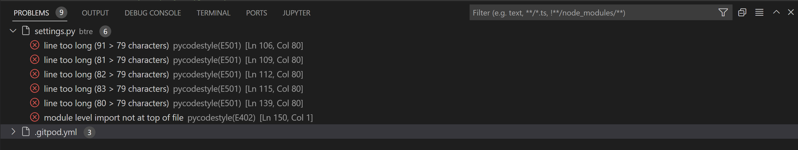
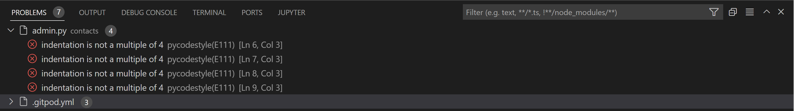
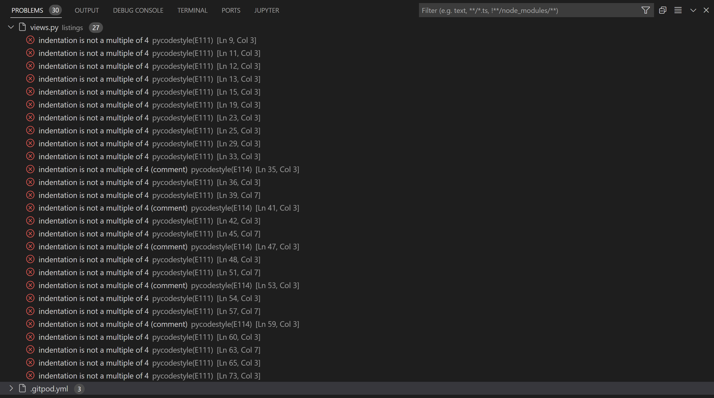
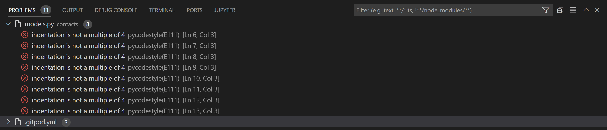
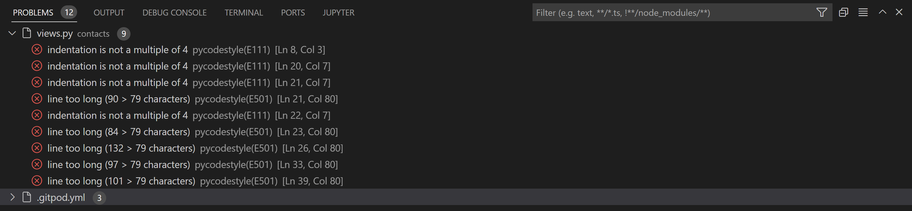
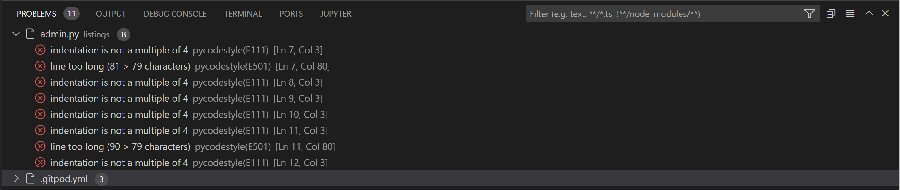
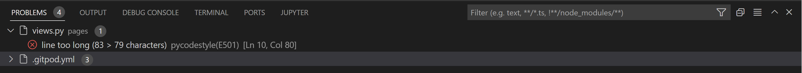
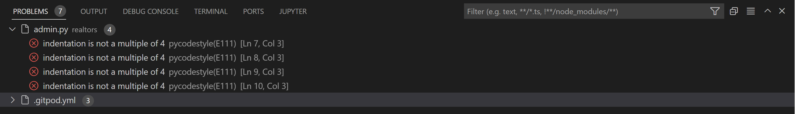
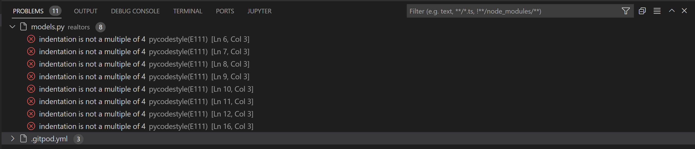
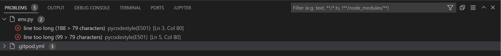

## <h1 align=center>**Real Estate Project**</h1>

<br>


#

<br>

## **Table of Contents**

- [Table of Contents](#table-of-contents)
- [Briefing](#briefing)
- [Overview](#overview)
- [User Experience | UX](#user-experience--ux)
  - [Administrative Functions](#administrtive-functions)
  - [User Stories](#user-stories)
  - [Scope](#scope)
  - [Structure](#structure)
  - [Schema](#schema)
  - [Design Choices](#design-choices)
- [Existing Features](#existing-features)
- [Technologies Used](#technologies-used)
- [Testing, Code Validation & Accessibility](#testing-code-validation--accessibility)
- [Unfixed Bugs](#unfixed-bugs)
- [Aknowledgments](#acknowledgements)

#
## **Briefing**
Fictional real estate for sale website. Real estate website's visitors can easily filter their searches by location, price, and other predefined criteria. Each property goes with a detailed description and property features, location, price, assigned realtor, and an image gallery. Buyer of real estate can make an inquiry for a listing by filling a form, and can view all the inquiries they have submitted by clicking on their dashboard.

**Disclaimer:** This project was merely a learning exercise as well as my first sizeable project delving into Django and PostgreSQL & a few other used technologies.

This project was created as part of the Full Stack Software Development course offered by Code Institute.

#
[Link to the final project](https://real-estate-project-yc.herokuapp.com/)
#

## **Overview**
A real estate listings website built with `python` `django` `javascript` `bootstrap`.

A simple, user-friendly and reponsive website developed using Python Django for the back-end, HTML, CSS, JavaScript and Bootstrap for the front-end, and PostgresQL for a database.

I tried to carry out the project with a practical manner as I would if I were building this for a client.

The project consists of both a front-facing website and the admin area. 
On the homepage there is a large search box with some fields to allow the user to filter among featured listings.
The search functionality is asctually pretty simple: it shows how to build query sets and how to filter your data when you are fetching from the database.
The user can search by keyword, city, state, number of bedrooms, and price. The bedrooms and price filters are a less than or equal to filter.
The search results page has a form on the top to allow the user to keep on searching easily.
Below the search box, we have the latest listings section, where will be placed whaever are the latest listings in the database.
Finally, at the bottom of the page there is just some static markup with some services.

On the about page we have some about data and three realtors; these can be added in the admin area, and they will automatically be shown in this section. For each realtor we have their name, phone number and email.
On the right of the page there is a checkbox for seller of the month, which can be also chosen in the admin area, so whoever is seller of the month among the realtors will be automatically shown up right there.
So, we have some dyniamic data on the about page as well.

The featured listings page composes of several listings, which right now I have set to six per page. For each listing we have the main image, the price, and some other data. Clicking for more info takes us to the single listing page, where we have breadcrumbs, the title, at the top, the address, and the assigned realtor on the right of the page.
So, realtors and listings have a relationship so that on the listings page we can access any of that particular realtor's information that we want. The idea is that each realtor is assigned certain listings.
On the single listing page, below the main image we have some smaller images that open up in a lightbox. Lightbox 2 has been used for this.
At the bottom we have some data like the sqft, the loft size, the price, description. Below the assigned realtor we have a 'make an inquiry' button: clicking on it opens up a module, and if the user is already registered and logged in from the front-facing website, the name and email sections of the module will be auto-populated from the database from that user.

When registering for an account by filling all the required fields and then clicking on the register button, the user gets a little message. I have used Django messages for this, and formatted them with Bootstrap, and have also added a little bit of Javascript so the message disappears after three seconds.
I didn't want the user to be direclty logged in after registering, but being redirected to the login page instead. Logging in takes the user to a dashboard, that is basically just a list of any inquiries that they have made.

We are also going to have the following functionality: if the user sends an inquiry for a listing, they get a success message saying they'll get back
to them. If the user tries to make another request
on the same property, they're going to get an
error saying they've already made that
request.

As regards the admin side, if I log in with an admin user first of all you can see that I have customized the colors
to match the branding, and that I have added the logo on the top left-hand corner here if we go to this side
There is some standard Django functionality that's there by default. In addition to that, we have realtors, listings (which we can also choose to unpublish by unchecking and saving, and then going back to the front-facing website) and contacts, where any inquiries that are made will be
put.
So, we can publish and unpublish really easily.

#
### Python version (Recommended):	3.8 Version 
Python 3.8 introduces some new syntax to the language, as well as a few small modifications to existing behavior and, most importantly, a slew of performance improvements, following in the footsteps of the previous 3.7 version.
#
### Programming Language Used:	Python Django Language
Django is a high-level Python web framework for building safe and maintainable websites quickly. Django is a web framework built by experienced developers that takes care of a lot of the heavy lifting so you can focus on developing your app instead of reinventing the wheel.
#
### Project Type:	Web Application
A web application, unlike computer-based software programs that operate locally on the device’s operating system, is application software that runs on a web server. The user uses a web browser with an active network connection to access web apps.
#
### Database : PostgreSQL
(https://www.postgresql.org/)

#
## **User Experience | UX**

### **Administrative Functions**

The application's administrative functions are intended to manage what each user can do within the system. Permissions such as adding, editing or removing a property, for example, should under no circumstances be given to the user of the application. Such functionalities must be assigned exclusively to the administrator.

In the system, there will be the following user functionalities:

- Admin: has permission in all areas of the system.
- Users: can search for properties filtering through the featured listings using the search box, in addition to being able to make an inquiry for a listing they're interested in.

### **User Stories**

**User**
- As a Site User I can register an account so that I can
- As a Site User I can login the application so that I can manage my account.
- As a Site User I can filter a listing according to its price so that I can choose the one that best suits my budget.
- As a Site User I can filter a listing according to its number of bedrooms so that I can choose the one that fits on my needs.
- As a Site User I can filter a listing according to its location so that I can choose the one that are of interest to me.
- As a Site User I can view a listing's info so that I can read more about it and see more pictures of it.

**Admin**
- As a Site Admin I want to be able to access the admin area so that I can add/edit/remove a new listing easily.
- As a Site Admin I want to be able to access the admin area so that I can add/edit/remove a new realtor easily.
- As a Site Admin I want to be able to access the admin area so that I can add/edit/remove a new user easily.
- As a Site Admin I want to be able to access the admin area so that I can add/edit/remove a new contact easily.

**Developer**
- As a Developer I want to ensure that all application features work as they were implemented to work.
- As a Developer I want to ensure an authenticated user can access all required information correctly.
- As a Developer I want to work together with the administrator of the site for improvements for the user of the same.


#
### **Scope**

* A website whose purpose is immediately understood by the user.
* Have a clear information on what the site is about and what it provides
* Have an easy navigation that is consistent throughout the website
* Consistent layout without any confusing elements
* Accessibility considerations are taken throughout the site
* A simple, straightforward, intuitive UX experience
* An explicit content
* An easy navigation for the user through all of the features
* A site that is visually appealing on most devices


#
### **Structure**

* A clear and straightforward layout is in place to ensure users can navigate intuitively and have a leisurely experience
* Navbar is fixed on top to facilitate users to navigate through pages easily
* A Small dropdown menu navigation is the same on all pages at small screen sizes to ensure easy navigation
* Functionalities such as register, search and make an inquiry generate straighforward forms to allow useres to use the features without issues 

#
### **Schema**

**Real Estate App Requirements**

Front-end Pages

- Home
- About
-	Listings
-	Single Listing
-	Search
-	Register
-	Login
-	Dashboard (Inquiries)

Design Specs

-	Use BTRE logo (Frontend and admin)
-	Branding colors – blue(#10284e) green(#30caa0)
-	Mobile Friendly
-	Social media icons & contact info
-	Doesn’t have to be too fancy but must be clean

Functionality Specs

-	Manage listings, realtors, contact inquiries and website users via admin
-	Role based users (staff and non-staff)
-	Display listings in app with pagination
-	Ability to set listings to unpublished
-	Search listings by keyword, city, state, bedrooms and price (Homepage & search page)
-	List realtors on about page with “seller of the month” (Control via admin)
-	Listing page should have fields listed below
-	Listing page should have 5 images with lightbox
-	Lightbox should scroll through images
-	Listing page should have a form to submit inquiry for that property listing
-	Form info should go to database and notify realtor(s) with an email
-	Frontend register/login to track inquiries
-	Both unregistered and registered users can submit form. If registered, can only submit one per listing

Listing Page Fields

-	Title
-	Address, city, state, zip
-	Price
-	Bedrooms
-	Bathrooms
-	Square Feet
-	Lot Size
-	Garage
-	Listing Date
-	Realtor – Name & Image
-	Main image and other images

Possible Future Functionalities

-	Google maps on listing page
-	Buyer testimonials
-	Account settings to allow user to manage profile picture, name and password, and delete account


#
### **Design Choices**

* Colours

The colour scheme was chosen based on the background image I wanted to use sitewide:
I used [Coolors](https://coolors.co/) to generate a colour palette based on the image.

><details><summary
[Show palette]</summary>
()
</details>


* Pictures
 
All images (background, listings, realtors) have been downloaded from [Pexels](https://www.pexels.com/).

#
## **Existing Features**

1. Homepage


2. About Page


3. Featured Listings Page


4. Admin Panel


5. Register Page


6. Login Page


#
## **Technologies Used**

+ Favicon Generator: Used to create favicon used on the website
+ Git: Gitpod IDE was used for version control by utilizing the Gitpod terminal to commit and Push to GitHub
+ GitHub: GitHub respository is used to store the project's code after being pushed from Gitpod
+ Django: Framework used to add structure to the platform
+ Bootstrap4: Framework used to add structure and responsiveness
+ Google Fonts: Google fonts are used to add fonts for aesthetic and UX purposes (https://fonts.google.com/)
+ Pillow: Python Imaging Library (https://pypi.org/project/Pillow/)
+ Cloudinary Platform: to host images (https://cloudinary.com/)

#
## **Testing, Code Validation & Accessibility**

### **Automated tests**
<br>

### **Lighthouse report**

All pages of the app were tested using the lighthouse function built into the Google Chrome browser on incognito mode.
  
[Link to the Lighthouse report for Homepage](https://googlechrome.github.io/lighthouse/viewer/?psiurl=https%3A%2F%2Freal-estate-project-yc.herokuapp.com%2F&strategy=desktop&category=performance&category=accessibility&category=best-practices&category=seo&category=pwa&utm_source=lh-chrome-ext)

[Link to the Lighthouse report for About page](https://googlechrome.github.io/lighthouse/viewer/?psiurl=https%3A%2F%2Freal-estate-project-yc.herokuapp.com%2Fabout&strategy=desktop&category=performance&category=accessibility&category=best-practices&category=seo&category=pwa&utm_source=lh-chrome-ext)

[Link to the Lighthouse report for Featured Listings page](https://googlechrome.github.io/lighthouse/viewer/?psiurl=https%3A%2F%2Freal-estate-project-yc.herokuapp.com%2Flistings%2F&strategy=desktop&category=performance&category=accessibility&category=best-practices&category=seo&category=pwa&utm_source=lh-chrome-ext)

[Link to the Lighthouse report for Register page](https://googlechrome.github.io/lighthouse/viewer/?psiurl=https%3A%2F%2Freal-estate-project-yc.herokuapp.com%2Faccounts%2Fregister&strategy=desktop&category=performance&category=accessibility&category=best-practices&category=seo&category=pwa&utm_source=lh-chrome-ext)

[Link to the Lighthouse report for Login page](https://googlechrome.github.io/lighthouse/viewer/?psiurl=https%3A%2F%2Freal-estate-project-yc.herokuapp.com%2Faccounts%2Flogin&strategy=desktop&category=performance&category=accessibility&category=best-practices&category=seo&category=pwa&utm_source=lh-chrome-ext)
  
#
### **CSS Validation**
  
  Only the custom CSS file was tested (style.css)
  
  

# 
### **HTML Validation**  
 
  All HTML was passed through the validator retreived from the source code within devtools on Chrome.

  [link to w3c validator result](https://validator.w3.org/nu/?showsource=yes&showoutline=yes&showimagereport=yes&doc=https%3A%2F%2Freal-estate-project-yc.herokuapp.com%2F)

#
### **Python Validation (PEP8)**

I have tried to test my code with https://pep8online.com/, but their domain has expired. 
As a workaround, I have added a PEP8 validator to my Gitpod Workspace directly by following these steps:
- Run the command pip3 install pycodestyle. Note that this extension may already be installed, in which case this command will do nothing.
- In your workspace, press Ctrl+Shift+P (or Cmd+Shift+P on Mac).
- Type the word linter into the search bar that appears, and click on Python: Select Linter from the filtered results.
- Select pycodestyle from the list.
- PEP8 errors will now be underlined in red, as well as being listed in the PROBLEMS tab beside your terminal.

Existing errors are either unsolved (like indentation errors) or have been purposely ignored as they do not affect code functionality(like line too long errors).
<details>
<summary>Screenshots of results of python files that presented problems</summary>











</details>

#
### **Manual Testing**
<br>
  I systematically manually tested all user inputs and functions in the website to compare feedback/results against expected results.  
  Any unexpected output/outcomes were fixed.  
  
### Desktop
  
  Google Chrome/Mozilla Firefox: All aspects of the site work perfectly fine. Pages load quickly, all features are working and found no problems with CRUD, registering and logging in or out, submitting inquiries, etc.

  * Every button works and redirects to the next page quickly<br>
  * Url's load correctly on both the About page and the Featured Listings page<br>
  * (Disabled function) Sign up form sends an automated email from a gmail account to the user to verify the email address; this works as it should.  

### Mobile

  Tested all aspects of the site via three devices, Apple Iphone 11, Samsung S20 and Samsung S7 tablet. The site reacts well to different devices, responsiveness works well, including on Apple's browser Safari.


## Deployment


<details>
<summary>Heroku Deployment Steps: </summary>

 1. Ensure all dependencies are listed within the requirements.txt file

 Within the terminal in Gitpod type `pip3 --local freeze > requirements.txt`, and a list with all requirements will be created to be read by Heroku.

 2. Setting up Heroku
  * NB Due to security issues connecting github directly to heroku (at the time this project was deployed),
    first you must log into your heroku account via the terminal in gitpod (more info on this further down).  
    2.1 Next, navigate to the [Heroku](https://www.heroku.com/) website
    2.2 Login to Heroku
    2.3 Click on `New` (top right) and Create a new app    
    2.4 Choose a project name and set your location
    2.5. Navigate to the `Resources` tab
    2.6. In the `Add ons` section, search for Heroku Postgres and select it on the list
      - A pop up will appear, select, 'Hobby Dev' and click `Submit order form`    
    2.7.1. Next, You would usually navigate to the `deploy` tab;
      - Click on connect to Github
      - Search for the repository named Metal-Re-Injection
      - And connect heroku to Github.<br>
    2.7.2. But, as mentioned above this is not possible for the time being.
      - So instead, In order to connect gitpod to heroku type:
          - `$ heroku login -i`
          - Then enter your heroku credentials,
          - Now you are logged into heroku in Gitpod
          - Once all code is commited and pushed to Github, simply push code from Gitpod to heroku using the command:<br>
          - Heroku will start the build process, this can be viewed under the `Activity` tab<br>
          - Once the build process has completed, navigate to `Open App`
          - The app should now be ready to view
    2.8. Navigate to the settings tab
    2.9.  Click on Config Vars, and add Cloudinary, Database URL (from Heroku-Postgres) and Secret key

</details>

<details>
<summary>Forking the GitHub Repository </summary>

* By forking the GitHub Repository, you will be able to make a copy of the original repository on your own GitHub account, allowing you to view and/or make changes without affecting the original repository by using the following steps:

    - Log in to your own GitHub and locate the GitHub Repository you wish to fork
    - At the top of the Repository (not top of page), just above the "Settings" button on the menu, locate the "Fork" button.
    - You should now have a copy of the original repository in your GitHub account

* Making a Local Clone

    - Log in to your own GitHub and locate the GitHub Repository
    - Under the repository name, click "Clone or download"
    - To clone the repository using HTTPS, under "Clone with HTTPS", copy the link
    - Open Git Bash
    - Change the current working directory to the location where you want the cloned directory to be made
    - Type git clone, and then paste the URL you copied in Step 3

 $ git clone https://github.com/Yari-Carelli/Real-Estate-Project

Press Enter. Your local clone will be created

</details>

#
### Run Server

```sh
python manage.py runserver 
```

#
## **Unfixed Bugs**

When trying to run the server in the gitpod workspace by typing the command above in the terminal, I get the following error:


I have managed to run the server anyway by typing the command `unset PGHOSTADDR` and pressing ENTER, then using the `python manage.py runserver` command. However, this must be done every time I try running the server in a new terminal.
I'm not sure what is causing this bug, perhaps the reason is that I have built the entire project working in my virtual environment.

#
## **Acknowledgements**

- Code institute for the amazing Tutors on the course
- My brilliant Mentor Rohit Sharma for his patience, excellent advice on my code, pushing me back on track
    when I started to lose faith, taking time out of his own day and duties to answer all of my questions with absolute perfection, and just generally being a Python God!
- My family for their support, patience and testing
- Everybody on Slack for tips, advice, quick fixes and support

[Back to top ⇧](#table-of-contents)